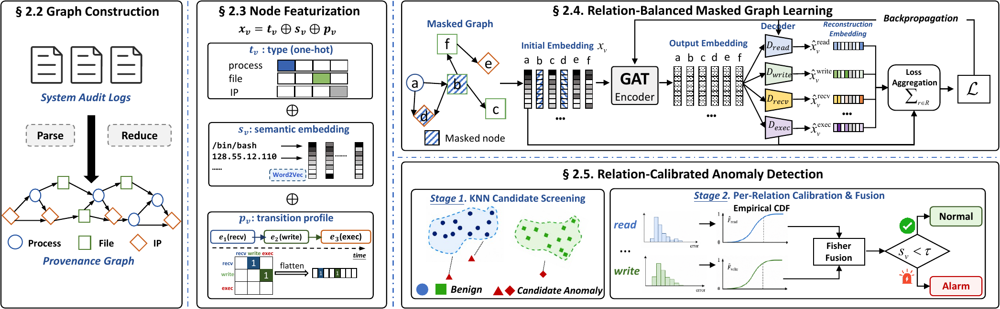

# RECAL

Official implementation of *Not All Relations Are Equal: Relation-Balanced and
Calibrated Graph Learning for Provenance-Based Intrusion Detection* (RECAL).

<p align="center">
  
</p>

## 🔍 Overview

RECAL keys both learning and scoring on the relation (edge type) of a provenance
graph.  During training, rare relations are masked harder than frequent ones, and
every node is reconstructed once per relation it participates in through a
per-relation decoder head; a single global mask rate with one shared head is the
degenerate case.  During detection, each per-relation reconstruction error is mapped
to its own quantile against an empirical CDF fitted on a held-out calibration graph,
and the relations of a node are combined into one anomaly score by Fisher's method
behind a k-NN candidate screen.

## 🗂️ Layout

```
configs/       base.yaml + one override per dataset; configs/ablation/*.yaml
preprocess/    parse_cdm.py (CDM JSON -> graphs), build_features.py
src/           graphio, masking, model/, inference, calibrate, detect, metrics
scripts/       train, eval, run_ablation, sweep_scoring, export_obs_data
plots/         fig2_observations.py
```

`data/`, `proc/` and `runs/` are resolved relative to the package root and are not in
the repository; create them (or symlink them to a large disk) before the first run.
`proc/` needs about 22 GB and `runs/` about 2 GB for all three datasets.

## 💾 Data

Experiments use the CADETS, THEIA and TRACE hosts of DARPA Transparent Computing
Engagement 3, <https://github.com/darpa-i2o/Transparent-Computing>.  Decompress the
CDM JSON volumes into `data/dataset/{cadets,theia,trace}/`; `preprocess/parse_cdm.py`
picks the volumes it needs.  Ground-truth label lists go in `data/label/{ds}.txt`
(see [Acknowledgements](#acknowledgements)).

## 📦 Install

```bash
pip install -r requirements.txt          # install torch from your GPU's index first
```

Message passing is torch_geometric, not DGL; `torch_scatter` / `torch_sparse` /
`pyg_lib` are not needed.

## 🚀 Run

```bash
for ds in cadets theia trace; do
  python -m preprocess.parse_cdm      --dataset $ds
  python -m preprocess.build_features --dataset $ds
  python -m scripts.train --config configs/$ds.yaml
  python -m scripts.eval  --config configs/$ds.yaml   # -> runs/${ds}_full/metrics.json
done

python -m scripts.run_ablation --dataset cadets       # -> runs/ablation_cadets.csv
python -m scripts.export_obs_data                     # -> runs/obs/*.csv
python plots/fig2_observations.py                     # -> runs/obs/fig2_*.pdf
```

Training is 200 epochs and takes about 217 s on TRACE, the largest dataset, on a
single GPU; `scripts/eval.py` reuses the saved model, and `scripts/sweep_scoring.py`
sweeps the scoring stage off the saved error tables without retraining.  Any config
value can be overridden without editing yaml:
`--override '{"detect": {"aggregation": "max"}}'`.

Counting follows THREATRACE's node-level protocol (IEEE TIFS vol. 17, 2022,
§VI-C-1); `src/metrics.py` implements it as a monotone score transform, so thresholds
and PR curves are unaffected.  `python -m scripts.eval` writes `metrics.json` and a
`diagnostics.json` with the PR curve, per-relation recall and a label-free operating
point taken at a 1% alarm rate on the calibration graph.

`Eq.N` refers to the paper.

## 📜 License

MIT, see `LICENSE`.

## 🙏 Acknowledgements

Parts of this repository are ported from or adapted from
[MAGIC](https://github.com/FDUDSDE/MAGIC) (MIT License, Copyright (c) 2023
Jimmyokok); each such file names its upstream counterpart in a header comment.
The evaluation protocol and node-level labels come from
[THREATRACE](https://github.com/threaTrace-detector/threaTrace) (IEEE TIFS
vol. 17, 2022), and the experiments use the
[DARPA Transparent Computing Engagement 3](https://github.com/darpa-i2o/Transparent-Computing)
dataset.  We thank the authors of these works for making them public.
